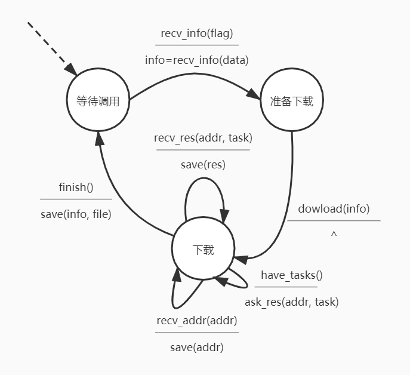
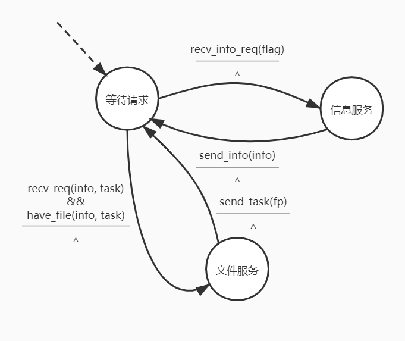

# wnt

> web network transmission

## 简介

web端采用vue+nwjs实现

[android端](https://github.com/Ghost-LZW/NetTransmission)使用原生android实现

使用socket基于tcp进行传输

基于p2p, 使用自定义p2p协议

用于HTML大作业和日常文件传输

### 客户端FSM



### 服务端FSM



## 协议简介

### 工作模式

将文件分割为多个任务点，按任务点进行服务

初始为单个任务点，任务点为0:文件大小

若无空闲任务点，则在所有任务点中找出未完成的最大任务点，分割为两份，新建任务点进行工作

当客服端接受到任意任务点，当作为服务端对其他客户端进行服务，对于每个请求，在本地查看是否为未完成任务点，若未，则返回失败请求

每次新客户端接入，服务端记录为新的服务地址，并向后来客户端暴露 (可选

### 协议格式

此协议中文本无特殊标记全为utf-8

* 请求长度 -- 3 Byte
* 协议版本 -- 以'\n'结尾
* 请求标志 -- 1 Byte
* 文件名长度 -- 1 Byte
* 文件名 -- 限定长度小于256
* 文件大小 -- 6 Byte
* (下载请求)任务点 -- 6 Byte
* (下载回复)任务点大小 -- 3Byte
* (下载回复)文件内容 -- 默认256KB
* 服务点信息 -- 可选
* 附加信息 -- 可选

本协议使用经典256KB文件块

0.1版本使用类似http1.0的每次建立tcp连接方式实现

#### 请求文件基本信息

将请求标志置为'1', 后续为空

请求发往文件服务器

#### 发送文件基本信息

将请求标志置为'2'，后续为空

请求发往客户端

#### 请求文件任务点数据

将请求标志置为'3'，添加任务点数据

请求发往服务端

#### 发送文件任务点数据

根据任务点，获取文件最多256KB数据

将任务点大小设定为获取文件大小，将文件内容设定为获取的任务点数据

可选加入服务点信息等

请求发往客户端

#### 失败返回

将请求标志置为'4'，后续为空

请求发往客户端

## 项目实现

使用vue, nwjs, elemet-ui覆盖率达90%

依赖于nodejs的Socket用于文件传输， 使用json作为配置文件。

若无公网ip，需要位于同一局域网下。但当有中转服务器作为暴露和转发时，也可联通两个局域网，进行通信。当非在多个对称nat下时，也可采用tcp打洞等方式进行通信。

### 项目目录

```text
│  App.vue
│  main.js
│  store.js
│
├─assets
│      logo.png
│
├─components
│      AsideBar.vue
│      FooterBar.vue
│      HeaderBar.vue
│      showTasks.vue
│
├─page
│      completedTasksPage.vue
│      downloadPage.vue
│      mainPage.vue
│      pausingTasksPage.vue
│      runningTasksPage.vue
│      serverPage.vue
│      servingTasksPage.vue
│      totTasksPage.vue
│
├─router
│      index.js
│
└─utils
        downloadManager.js
        FileManager.js
        serversManager.js
        sessionStorage.js
        WorkPool.js
```

### 具体实现

使用vue+nwjs+nodejs 进行构建

vue方便提供界面编写

nodejs提供文件操作，多线程，socket等实现

nwjs提供dom树上操作和链接nodejs

#### 获取文件

使用手动输入，获取服务器地址

使用nodejs Socket发送协议请求，对回复进行接受，接受完后关闭连接

当下载文件时，设定下载线程上线

使用线程池用于管理, 使用nodejs提供的多线程功能

首先对每个服务器地址建立下载线程

每次下载，根据当前线程数，进行松弛操作。如果线程数未到达上限，再新建一个线程，类似于慢启动

#### 服务文件

使用ServerSocket进行服务

选择文件，点击server即可

可选监听端口

对于每个文件请求，如果在服务列表，则进行服务

#### 展示数据

使用el-table进行数据展示

使用点击进行暂停开始等操作

提供侧边栏，页首，页脚进行页面操作

界面美观，功能易懂

## 项目前瞻

1. 为方便起见，0.1版协议使用类似http1.0的每次建立tcp连接方式实现，每次建立和拆除tcp连接的消耗过大，可采用建立tcp连接池等方式加快速度

2. 线程上线被设定为当前cpu线程数，可以增加线程上限， 增加传输速度

3. 为方便起见，文件写入采用互斥单线程写入，可以采用文件分块结合，多线程写入，加快文件传输速度，本地文件io速度

4. 服务端未固定端口，可固定化端口以方便传输确定地址

5. 协议中增加hash值校验，为方便起见，0.1将hash值校验加入附加信息中，作为可选服务，但未保证可靠性，将后续固化入协议中

6. 协议中增加可选加密项，未方便起见，0.1将加密服务加入附加信息中，作为可选服务，但未保证保密性，将后续固化入协议中

7. 完善ui，增加可配置项

## Build Setup

``` bash
# install dependencies
npm install

# serve with hot reload at localhost:8080
npm run dev

# build for production with minification
npm run build

# build for production and view the bundle analyzer report
npm run build --report

# run unit tests
npm run unit

# run e2e tests
npm run e2e

# run all tests
npm test
```

For a detailed explanation on how things work, check out the [guide](http://vuejs-templates.github.io/webpack/) and [docs for vue-loader](http://vuejs.github.io/vue-loader).

## Licensed

```text
Copyright [2020] [ghost-lzw]

Licensed under the Apache License, Version 2.0 (the "License");
you may not use this file except in compliance with the License.
You may obtain a copy of the License at

    http://www.apache.org/licenses/LICENSE-2.0

Unless required by applicable law or agreed to in writing, software
distributed under the License is distributed on an "AS IS" BASIS,
WITHOUT WARRANTIES OR CONDITIONS OF ANY KIND, either express or implied.
See the License for the specific language governing permissions and
limitations under the License.
```
